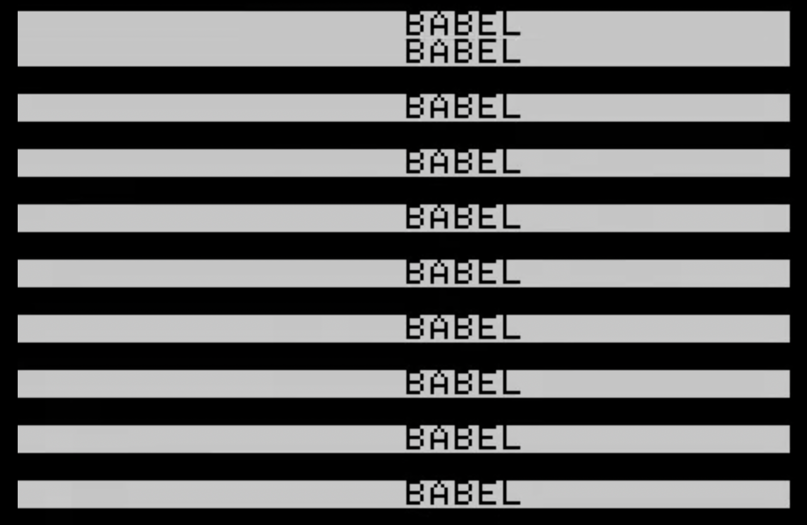

# Courses Taught

## Senior Undergraduate

*Oana Avasilichioaei, "Operator" [screenshot] , 2019*

### Digital Cultures: The Datafied/Datafying Subject

What is/are “data” anyway? How have stories told about and through data shaped our perception of ourselves and the world around us? In this course, we will explore the implications of the datafied subject, including the rise of dataveillance and its role in the construction and commodification of the digital self. Together, we will think-through how data have been imagined by different communities throughout history and wrestle with the contradictions and seductive potentialities of the data dys/utopia. We will look, as well, to data activism and surveillance art, which reimagine data practice as tools of counter and anti-dataveillance resistance and critique. As part of the course, students will carry out a research creation project, using the data literacy skills we have developed over the semester to critically engage with and creatively interpret and respond to a data set.

## Junior Undergraduate

*bpNichol, First Screening [screenshot], 1984*

### Intro to Critical Analysis: Techno-Narratives

In this course, students will explore methods of critical analysis. Through engagement with 'techno-narratives,' stories told about and through technology, students will develop their abilities to communicate original, evidence-based interpretation of texts in a variety of mediums. We will consider how technological developments have impacted the narrative form and given rise to new modes of storytelling including science fiction, interactive texts, and video games. Students will engage with key questions such as how does technology shape our perception of ourselves and the world around us? And what does it mean to be human in the age of the machine?
